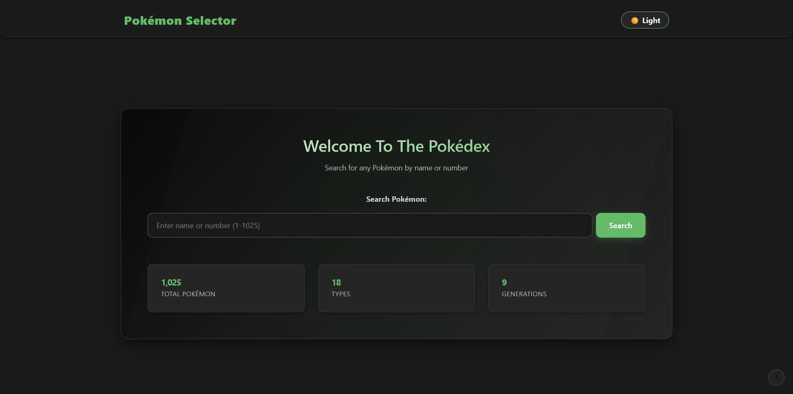
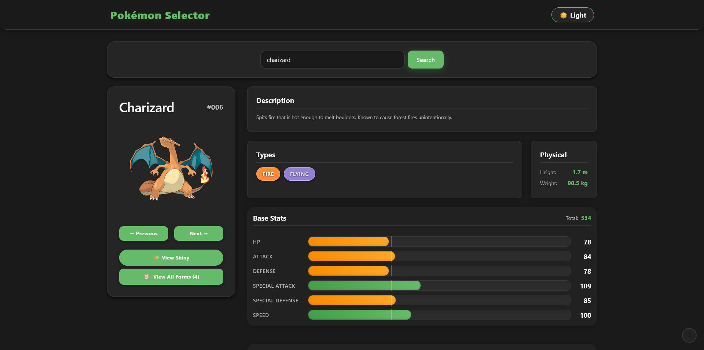
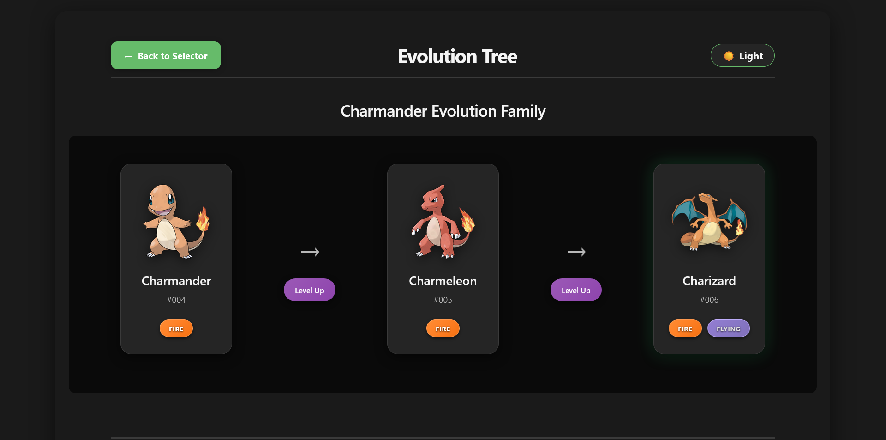

# 🔴 Pokémon Selector

An interactive and feature-rich Pokédex application built with vanilla HTML, CSS, and JavaScript. This project allows users to search for any Pokémon and view detailed information, including stats, forms, evolution chains, and type effectiveness.



This project was built as a demonstration of modern front-end development practices using vanilla web technologies.

---

## ✨ Features

-   **🔍 Comprehensive Search**: Find Pokémon by name or National Pokédex number with autocomplete suggestions as you type.
-   **📊 Detailed Information**: View a Pokémon's stats, height, weight, abilities, and description.
-   **✨ Interactive Sprites**: Instantly toggle between a Pokémon's default and shiny sprites.
-   **🧬 All Forms & Varieties**: Browse all available forms, such as Mega Evolutions, Alolan, or Gigantamax forms.
-   **🛡️ Type Effectiveness**: See a detailed breakdown of a Pokémon's weaknesses, strengths, and immunities.



---

-   **🌱 Evolution Viewer**: Explore a Pokémon's full evolution chain, including complex branches, on a dedicated page.



-   **📖 Search History**: Quickly access your recently viewed Pokémon.
-   **🌗 Theme Toggle**: Switch between a light and dark theme for comfortable viewing.
-   **⌨️ Keyboard Shortcuts**: Navigate the app efficiently (press `?` to see available shortcuts).
-   **📱 Fully Responsive**: A mobile-first design that works seamlessly on all screen sizes.

---

## 🚀 Getting Started

This project uses modern JavaScript (ES6 Modules), which requires it to be run from a web server to function correctly due to browser security policies.

### Prerequisites

-   A modern web browser (e.g., Chrome, Firefox, Edge).
-   A local web server. The [**Live Server**](https://marketplace.visualstudio.com/items?itemName=ritwickdey.LiveServer) extension for VS Code is highly recommended.

### Installation & Launch

1.  **Clone the repository:**
    ```bash
    git clone <repository-url>
    ```

2.  **Navigate to the project directory:**
    ```bash
    cd Pokemon-selector3
    ```

3.  **Launch the application:**
    Right-click the `index.html` file and select "Open with Live Server" (if you have the VS Code extension). Alternatively, serve the project folder using any local server and open the address in your browser.

---

## 🛠️ Technologies & Architecture

This project emphasizes a clean, modern, and maintainable vanilla-stack architecture without relying on any frameworks.

-   **HTML5**
-   **CSS3**: Organized using a modular BEM-like methodology.
-   **Vanilla JavaScript (ES6+)**: The entire application is built using modern JavaScript features like modules, classes, and async/await.
-   **PokéAPI**: All Pokémon data is sourced from the free and open-source [PokéAPI](https://pokeapi.co/).

### Key Architecture Patterns

-   **Component-Based:** The UI is broken down into self-contained JavaScript classes (e.g., `PokemonDisplay`, `PokemonSearch`), promoting reusability and separation of concerns.
-   **Modular:** Leverages ES6 `import`/`export` for clean dependency management without a bundler.
-   **Centralized State:** A simple, custom state management system (`core/state.js`) handles application-wide data and caching.
-   **API Abstraction:** All interactions with the PokeAPI are handled through a dedicated module (`modules/api.js`), making it easy to manage endpoints and data fetching.

---

## 📁 Project Structure

The project is organized logically into `css`, `js`, `pages`, and other directories to maintain a clean and scalable codebase.

<details>
<summary><strong>Click to view the detailed file structure</strong></summary>

```
Pokemon-selector3/
├── index.html
├── pages/
│   └── evolution.html
├── css/
│   ├── main.css
│   ├── evolution-main.css
│   ├── base/
│   ├── components/
│   ├── layout/
│   ├── themes/
│   └── utilities/
├── js/
│   ├── main.js
│   ├── evolution-main.js
│   ├── components/
│   ├── core/
│   ├── evolution/
│   ├── features/
│   └── utils/
├── modules/
│   ├── api.js
│   ├── autocomplete.js
│   ├── errorHandler.js
│   └── (etc...)
└── data/
    └── typeChart.js
```

</details>

---

## 📄 License

This project is licensed under the MIT License. See the `LICENSE` file for more details.
